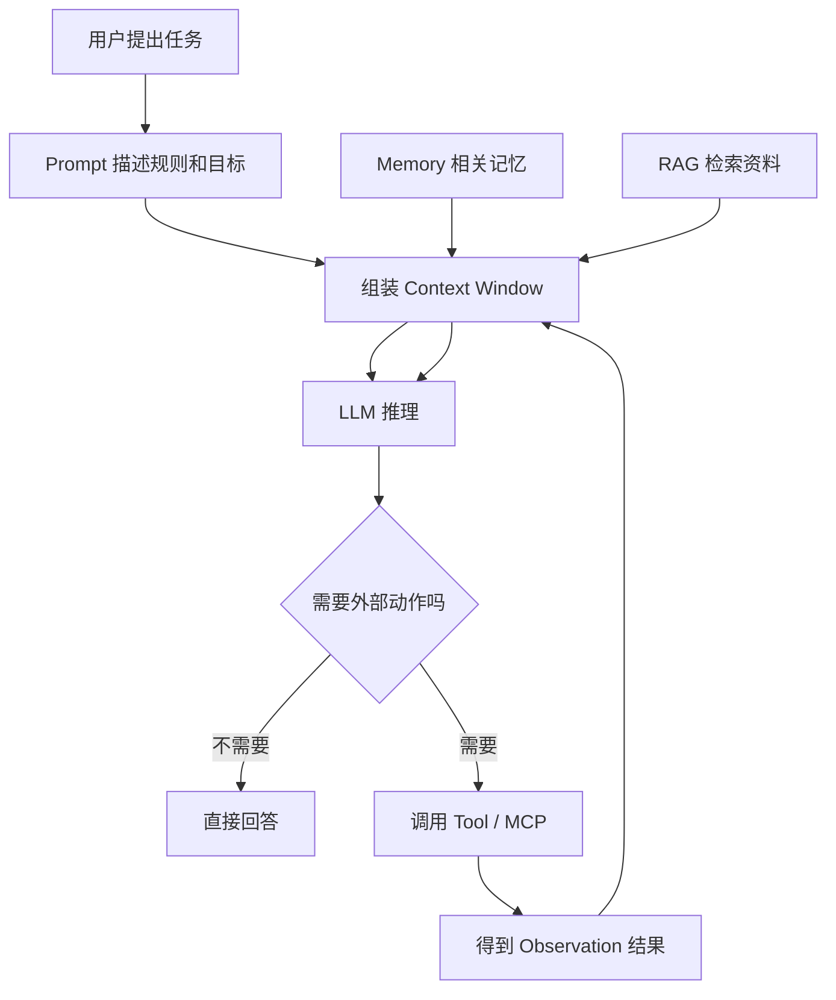

# 01 | AI 系统分层总览：先把整张地图看懂

## 1. 先用一句话说人话

一个 AI Agent 系统不是“一个大模型”这么简单，它更像一个会干活的实习生团队：

- **LLM** 是大脑，负责理解和生成。
- **Token** 是大脑能读懂的文字颗粒。
- **Context Window** 是这次工作桌面上摆着的资料。
- **Prompt** 是你给它的工作要求。
- **RAG / Memory** 是资料库和笔记本。
- **Tool / MCP** 是它能使用的外部工具和标准接口。
- **Agent Loop** 是它不断“想一想、做一步、看结果、再调整”的工作流程。
- **Skill** 是沉淀下来的做事方法。

---

## 2. 为什么要先学这张图

初学者最容易把这些词混在一起：

```text
LLM、Agent、RAG、Prompt、Memory、Tool、MCP、LangChain、LangGraph
```

如果没有总图，你会觉得每个词都是一个新技术；但有了分层后，它们只是不同位置的组件。

---

## 3. 用生活类比理解

你可以把 Agent 系统想象成“一个新人在办公室完成任务”：

| 办公室场景 | AI 系统组件 | 解释 |
|---|---|---|
| 新人的脑子 | LLM | 负责理解、推理、写答案 |
| 新人每次能读多少资料 | Context Window | 桌面空间有限，资料太多会看不过来 |
| 你给新人的任务说明 | Prompt | 告诉它要做什么、怎么做、不能做什么 |
| 公司资料库 | RAG | 需要时去查外部资料 |
| 新人的工作笔记 | Memory | 记住之前做过什么、用户偏好是什么 |
| 电脑、浏览器、数据库 | Tool | 让它可以实际执行操作 |
| 标准插线板和接口规范 | MCP | 让不同工具都能按统一方式接入 |
| 工作流程 | Agent Loop | 计划、执行、检查、修正 |
| SOP 操作手册 | Agent Skill | 把常见任务沉淀成固定做法 |

---

## 4. 技术上到底怎么工作



重点：模型每一轮真正能使用的，只有 **Context Window 里的内容**。外部记忆和资料库必须先被检索、筛选、压缩，再放进上下文。

---

## 5. 和相似概念的区别

| 概念 | 容易混淆 | 正确理解 |
|---|---|---|
| LLM | Agent | LLM 是大脑，Agent 是大脑 + 记忆 + 工具 + 流程 |
| Prompt | Context | Prompt 是指令，Context 是本轮所有输入信息的集合 |
| RAG | Memory | RAG 查外部知识库，Memory 记用户/任务历史 |
| Tool | MCP | Tool 是具体工具，MCP 是工具接入标准 |
| Agent Skill | Tool | Tool 是单个能力，Skill 是一套做事流程 |

---

## 6. 面试怎么回答

### 30 秒版

AI Agent 系统可以分成五层：底层是 LLM 和 Token；中间用 Context Window 承载 Prompt、历史、RAG 和工具结果；再通过 Tool 或 MCP 连接外部系统；上层用 Agent Loop 做规划、执行和反馈；最后用 Skill 把可复用工作流沉淀下来。

### 2 分钟版

普通 LLM 主要负责文本生成，而 Agent 要完成任务，所以它需要更多组件。首先 LLM 是推理引擎，Token 决定上下文长度、成本和延迟。其次 Context Window 是模型本轮能看到的信息，包括系统提示词、用户问题、历史消息、RAG 检索结果和工具返回。然后 Tool / MCP 让模型能调用外部 API、数据库或文件系统。最后 Agent 通过 Think-Act-Observe 或 Explore-Plan-Act 的循环不断推进任务。如果某类任务经常出现，还可以封装成 Agent Skill，提高复用性和稳定性。

---

## 7. 常见追问

### Q1：为什么不是上下文越长越好？

因为上下文越长，模型注意力越分散，可能出现 Context Rot：明明信息在上下文里，模型却忽略了关键细节。

### Q2：为什么 Agent 一定需要工具？

不一定所有 Agent 都需要工具，但没有工具的 Agent 只能“说”，不能“做”。工具让它能查数据库、读文件、调 API、执行代码。

### Q3：MCP 是不是 RAG？

不是。RAG 是检索知识的方案，MCP 是连接外部工具和资源的标准协议。MCP Server 可以提供 RAG 资源，但二者不是一回事。

---

## 8. 常见误区

- **误区 1：会聊天就是 Agent**。错，Agent 重点是能自主规划和执行任务。
- **误区 2：工具越多越好**。错，工具越多越容易选错，需要清晰描述和权限控制。
- **误区 3：RAG 能解决所有幻觉**。错，检索错了或上下文组织不好，仍然会幻觉。
- **误区 4：Memory 等于 Context**。错，Memory 是外部存储，Context 是本轮输入。

---

## 9. 自检清单

- [ ] 能用“新人办公室”类比讲清 Agent 系统
- [ ] 能区分 LLM、Agent、RAG、Memory、Tool、MCP
- [ ] 能画出用户请求到工具调用再回到模型的流程
- [ ] 能说出 Agent 为什么比 Chatbot 更复杂
