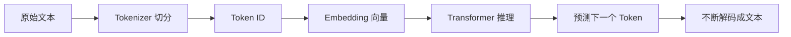

# 02 | LLM 与 Token：先搞懂模型到底在“读什么”

## 1. 先用一句话说人话

LLM 是大模型的大脑，Token 是它能读懂的“文字小块”。你输入的每句话、历史记录、工具结果、RAG 文档，最后都会被切成 Token 再交给模型处理。

---

## 2. 为什么初学者必须懂 Token

因为 Agent 的三个核心问题都和 Token 有关：

1. **成本**：输入和输出 Token 越多，调用越贵。
2. **速度**：Token 越多，推理越慢。
3. **记忆限制**：Context Window 能装的 Token 有上限。

所以面试中问“为什么 Agent 成本高”“为什么要压缩上下文”“为什么工具结果不能全塞进去”，本质都在问 Token 管理。

---

## 3. 用生活类比理解

你可以把 LLM 想成一个只能读“便利贴”的人：

- 一整篇文章会被拆成很多张便利贴。
- 每张便利贴就是一个 Token。
- 这个人桌子上最多只能放固定数量的便利贴。
- 如果便利贴太多，他就看不完、看漏、或者成本变高。

Context Window 就是桌子大小。

---

## 4. Token、字符、单词不是一回事

| 文本单位 | 说明 |
|---|---|
| 字符 | 你看到的一个字或符号 |
| 单词 | 英文里的词，中文没有天然空格 |
| Token | 模型内部切分后的文本单位 |

中文、英文、代码、标点被切 Token 的方式不同。比如代码里的缩进、括号、变量名也会消耗 Token。

---

## 5. Agent 为什么更耗 Token

普通聊天可能是：

```text
用户问题 → 模型回答
```

Agent 是：

```text
用户问题
+ 系统提示词
+ 工具列表
+ 历史消息
+ RAG 检索结果
+ 工具调用参数
+ 工具返回结果
+ 中间状态
→ 模型下一轮推理
```

而且这个过程会循环很多轮，所以 Token 很容易爆炸。

---

## 6. 技术上到底怎么工作



你不需要一开始就懂 Transformer 所有细节，但要知道：模型不是直接“看中文句子”，而是看 Token 序列。

---

## 7. 常见推理参数怎么理解

| 参数 | 人话解释 | 面试说法 |
|---|---|---|
| `temperature` | 模型回答有多“放飞” | 低温更稳定，高温更有创造性 |
| `top_p` | 从多大候选范围里选词 | 控制采样范围 |
| `max_tokens` | 最多生成多长 | 控制成本和输出长度 |
| context length | 桌子能放多少便利贴 | 输入 + 输出总容量 |
| `tool_choice` | 是否让模型调用工具 | 控制 Agent 自主调用工具的策略 |

面试中可以补一句：代码生成、工具调用、结构化 JSON 输出通常 temperature 要低，因为稳定比创造力重要。

---

## 8. 和相似概念的区别

| 概念 | 区别 |
|---|---|
| Token | 模型处理文本的单位 |
| Embedding | Token 或文本片段变成的向量表示 |
| Context Window | 一次推理能容纳的 Token 总量 |
| Memory | 外部存储的信息，不等于 Token，只有放进上下文才消耗 Token |
| RAG Chunk | 检索出来的一段文档，注入上下文后会变成 Token |

---

## 9. 面试怎么回答

### 30 秒版

Token 是大模型处理文本的基本单位，所有输入输出都会被切成 Token。Agent 比普通聊天更耗 Token，因为它要携带系统提示词、历史消息、工具描述、RAG 资料和工具结果，而且会多轮循环。优化方式包括摘要压缩、工具结果清理、RAG top-k 控制、Prompt 精简和分层记忆。

### 2 分钟版

LLM 推理时不是直接理解整段文字，而是先通过 Tokenizer 把文本切成 Token，再转换为向量进行 Transformer 推理。Agent 的上下文通常包含 Prompt、历史对话、工具列表、RAG 检索结果和工具返回，因此输入 Token 很多；多轮循环还会让历史不断增长。Token 多会导致成本升高、延迟增加和 context rot。所以工程上要做 token budget 管理，比如控制 RAG 召回数量、清理冗长工具结果、定期 compaction、只保留高相关记忆。

---

## 10. 常见追问

### Q1：为什么工具结果不能原样全部放进上下文？

因为工具结果可能很长，会消耗大量 Token，还可能污染上下文。应该提取关键字段、摘要或只保留必要部分。

### Q2：为什么长上下文仍然可能答错？

因为长上下文会稀释注意力，模型不一定能准确抓住关键细节，这叫 Context Rot。

### Q3：怎样降低 Agent 成本？

减少无效 Token：精简 Prompt、限制 RAG top-k、压缩历史、缓存结果、用小模型做简单判断。

---

## 11. 自检清单

- [ ] 能解释 Token 不是字也不是词
- [ ] 能解释为什么 Agent 比普通聊天更费 Token
- [ ] 能说出至少 5 种 Token 优化方法
- [ ] 能解释 temperature、max_tokens、context length
