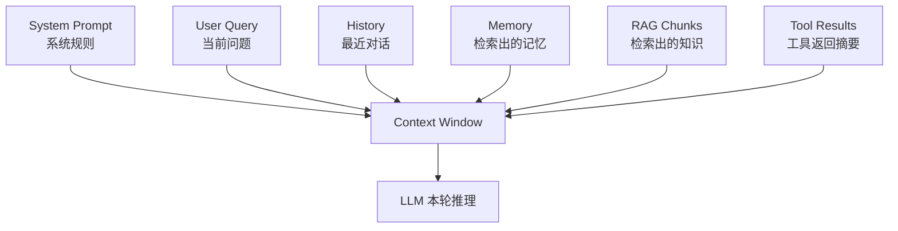

# 03 | Context Window：模型这次到底“看见了什么”

## 1. 先用一句话说人话

Context Window 就是模型这一次回答问题时能看到的全部资料。模型看不到你电脑里的所有文件，也看不到数据库里的所有内容，除非你把相关内容放进它的 Context Window。

---

## 2. 为什么它很重要

很多初学者会误以为：

- “我之前说过，模型应该记得。”
- “资料在知识库里，模型应该知道。”
- “工具刚刚返回过，模型应该能用。”

但真实情况是：**模型只能使用当前上下文窗口里的信息**。如果信息没有被放进去，模型就像没看见。

---

## 3. 用生活类比理解

把模型想象成开卷考试的学生：

- 考场桌面 = Context Window
- 试卷要求 = Prompt
- 课本资料 = RAG 知识库
- 课堂笔记 = Memory
- 计算器/搜索工具 = Tool

学生真正能用的，是考试时桌面上摆着的资料。课本在图书馆里没用，除非你先翻出来放到桌上。

---

## 4. Context 里通常有什么

---

## 5. Context、Memory、RAG、Prompt 的区别

| 概念 | 人话解释 | 是否自动被模型看到 |
|---|---|---|
| Prompt | 你给模型的任务说明和规则 | 是，通常直接放入上下文 |
| Context Window | 当前桌面上的所有信息 | 是，模型只能看这里 |
| Memory | 外部笔记本，记录历史和偏好 | 否，要检索/摘要后放入上下文 |
| RAG | 外部资料库检索 | 否，要召回相关 chunk 后放入上下文 |
| Tool Result | 工具执行结果 | 通常要摘要后放入上下文 |

---

## 6. Context Packing：怎么装上下文

上下文空间有限，所以要按优先级装：

1. **安全和角色规则**：不能丢。
2. **当前用户问题**：最重要。
3. **任务状态**：现在做到了哪一步。
4. **高相关记忆**：只拿和当前任务有关的。
5. **RAG 资料**：只放最相关几段。
6. **工具结果摘要**：不要放一大坨原始日志。
7. **最近对话**：保留最近几轮，旧内容压缩。

这就叫 Context Packing。

---

## 7. 常见问题

### Context Pollution：上下文污染

把无关、重复、太长的信息塞进去，会让模型分心。

例子：

- 搜索结果返回 100 条，全塞进上下文
- 工具日志 5000 行，全塞进去
- 旧对话不筛选，一直保留

### Context Rot：上下文腐烂

上下文很长时，即使关键信息在里面，模型也可能忽略或混淆。

### Over-compression：压缩过头

摘要太短，把关键细节删掉，后续任务就接不上。

---

## 8. 面试怎么回答

### 30 秒版

Context Window 是模型本轮推理能看到的全部信息。Memory 和 RAG 都是外部信息源，必须经过检索、筛选或摘要后放进 Context Window，模型才能利用。工程上要做 Context Packing，控制优先级和 Token 成本，避免上下文污染和 Context Rot。

### 2 分钟版

我会把 Context Window 理解为模型的工作台。Prompt 是规则，用户问题是当前目标，RAG 是外部知识库，Memory 是长期笔记，Tool Result 是工具返回结果。这些信息不会天然被模型看到，必须先筛选和装配进上下文。由于 Context Window 有 Token 上限，而且长上下文会带来注意力稀释，所以要按优先级放入高价值信息：系统规则、当前任务、任务状态、相关记忆、RAG chunk 和工具结果摘要。这样既能保证模型有足够信息，又能避免无关信息污染。

---

## 9. 常见追问

### Q1：Memory 和 Context Window 是一个东西吗？

不是。Memory 是外部存储，Context Window 是模型本轮实际看到的内容。Memory 需要被检索或摘要后放进 Context。

### Q2：RAG 检索出来越多越好吗？

不是。召回太多会浪费 Token，还可能引入噪声。通常要 top-k 控制和 reranker 精排。

### Q3：长上下文模型是不是不需要 RAG？

不是。长上下文能装更多信息，但 RAG 仍然负责从大规模知识库中筛选相关信息，减少噪声和成本。

---

## 10. 自检清单

- [ ] 能解释 Context Window 是模型当前工作台
- [ ] 能区分 Prompt、Memory、RAG、Tool Result
- [ ] 能解释 Context Packing
- [ ] 能说明 Context Pollution 和 Context Rot
