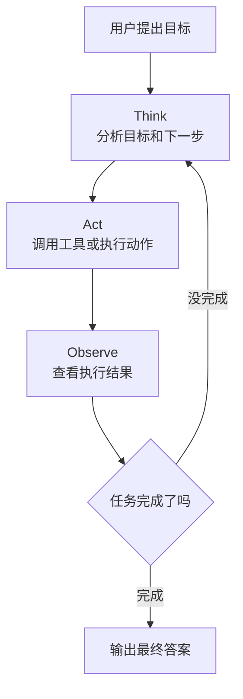

# 00 | Agent 核心概念初学者版：先把最常见的词讲明白

## 1. 先用一句话说人话

AI Agent 可以理解为“会自己想办法完成任务的 AI 助手”。普通 Chatbot 主要负责回答问题，Agent 不只回答，还会根据目标自己决定要不要查资料、调用工具、执行步骤、检查结果。

---

## 2. 为什么需要 Agent

普通大模型像一个很会聊天的人，但它有三个限制：

1. **只能生成文字**：不会真的去查数据库、发请求、改文件。
2. **不知道实时信息**：训练后发生的事情它可能不知道。
3. **做复杂任务容易乱**：多步骤任务需要计划、执行和检查。

Agent 就是为了解决这些问题：让大模型从“只会说”变成“能按步骤做事”。

---

## 3. 用生活类比理解

你可以把三者这样理解：

| 类型 | 类比 | 能做什么 |
|---|---|---|
| Chatbot | 会聊天的同学 | 解释概念、回答问题 |
| RAG 系统 | 会翻书的同学 | 先查资料，再回答 |
| Agent | 会办事的实习生 | 查资料、列计划、用工具、检查结果 |

所以，Agent 的关键不是“回答得更长”，而是**能不能为了完成目标主动行动**。

---

## 4. Agent 的四个核心能力

| 能力 | 人话解释 | 示例 |
|---|---|---|
| 感知 | 读取当前信息 | 读用户问题、读文件、看工具结果 |
| 规划 | 想清楚步骤 | 先查资料，再写代码，再测试 |
| 行动 | 调用工具执行 | 搜索、查库、写文件、调用 API |
| 记忆 | 记住重要信息 | 记住用户偏好、任务进度、历史结论 |

如果一个系统只有 LLM 回答，没有规划、工具和反馈，一般不能算完整 Agent。

---

## 5. Agentic Loop 是什么

Agentic Loop 就是 Agent 做事的循环：

```text
Think：先想下一步做什么
Act：执行一个动作，比如调用工具
Observe：看工具返回了什么
Repeat：如果没完成，就继续下一轮
```



---

## 6. ReAct 是什么

ReAct = Reasoning + Acting，也就是“边推理边行动”。

可以理解成：

```text
Thought：我现在需要查天气
Action：调用 weather_api
Observation：API 返回今天下雨
Thought：根据天气提醒用户带伞
Final Answer：今天下雨，建议带伞
```

ReAct 的价值是让模型不要直接瞎答，而是先想清楚需要什么信息，再调用工具拿证据。

---

## 7. Function Call 是什么

Function Call 是模型请求调用工具的一种标准格式。

你可以把它理解成：模型不会真的自己点按钮，它只会填写一张“工具调用申请表”：

```json
{
  "name": "search_weather",
  "arguments": {
    "city": "杭州",
    "date": "today"
  }
}
```

系统收到这张表后，真正去执行工具，再把结果返回给模型。

---

## 8. Multi-Agent 是什么

Multi-Agent 就是多个 Agent 分工合作。

生活类比：做一份调研报告时，可以分成：

- 研究员 Agent：负责查资料
- 写作 Agent：负责组织成文章
- 审核 Agent：负责检查错误
- 协调器 Orchestrator：负责安排顺序和汇总结果

Multi-Agent 的好处是分工清晰，坏处是通信和状态管理更复杂。

---

## 9. MCP 是什么

MCP 可以理解为“AI 工具接入的统一插座标准”。

没有 MCP 时，每个工具都要单独适配不同 Agent 框架；有 MCP 后，工具可以通过统一协议暴露给不同 AI 应用。

一句话：

> Tool 是具体工具，Function Call 是调用工具的格式，MCP 是把工具、资源、提示词统一接入 AI 应用的协议。

---

## 10. 最容易混的概念对比

| 概念 | 一句话区别 |
|---|---|
| LLM | 负责理解和生成的大脑 |
| Chatbot | 用 LLM 聊天的应用 |
| RAG | 先查资料再回答的系统 |
| Agent | 会规划、调用工具、观察结果的任务执行系统 |
| Tool | 一个具体外部能力 |
| Function Call | 模型调用工具时输出的结构化请求 |
| MCP | 工具和资源接入 AI 应用的统一协议 |
| Memory | 存在外部的历史和状态 |
| Context Window | 模型当前这次推理能看到的信息 |

---

## 11. 面试怎么回答

### 问题 1：AI Agent 和普通 Chatbot 的区别是什么？

**30 秒版：**

Chatbot 主要是基于 LLM 做文本生成，能力边界通常停留在“回答问题”。AI Agent 则是任务执行系统，它能根据目标进行规划，调用工具获取外部信息或执行动作，并根据结果继续调整，直到完成任务。

**2 分钟版：**

我会从能力边界区分它们。Chatbot 的核心是对话生成，用户问什么它答什么；RAG 系统在 Chatbot 基础上加了检索能力，可以查知识库再回答；Agent 更进一步，它具备感知、规划、行动和记忆的闭环。比如用户让它分析一个代码库，Agent 会先读取文件，制定排查计划，调用搜索或测试工具，根据结果继续调整。它的重点不是生成文本，而是完成任务。

---

### 问题 2：Agentic Loop 是什么？

**30 秒版：**

Agentic Loop 是 Agent 的基本工作循环：先 Think 分析下一步，再 Act 调用工具或执行动作，然后 Observe 观察结果，如果任务没完成就继续循环，直到输出最终答案。

**2 分钟版：**

Agentic Loop 解决的是复杂任务不能一次生成完成的问题。每一轮里，LLM 先根据当前上下文判断下一步要做什么；如果需要外部信息，就通过 Function Call 调用工具；工具返回结果后作为 Observation 放回上下文，模型再继续推理。生产环境中要设置最大轮数、工具超时、错误重试和人工确认，避免死循环或危险操作。

---

### 问题 3：ReAct 和 Function Call 有什么关系？

ReAct 是一种“推理 + 行动”的策略框架，Function Call 是执行工具调用的结构化协议。可以理解为：ReAct 决定“什么时候该行动”，Function Call 负责“行动请求怎么写得规范”。

---

## 12. 常见误区

- **误区 1：Agent 就是接了工具的 Chatbot**。错，关键还要有自主决策、状态跟踪和反馈循环。
- **误区 2：RAG 就是 Agent**。错，RAG 主要解决知识检索，Agent 解决任务执行。
- **误区 3：Multi-Agent 一定更强**。错，简单任务用单 Agent 更稳定，多 Agent 会增加通信成本。
- **误区 4：Function Call 是模型真的执行函数**。错，模型只是输出调用请求，真正执行的是外部系统。

---

## 13. 自检清单

- [ ] 能用“会办事的实习生”解释 Agent
- [ ] 能区分 Chatbot、RAG、Agent
- [ ] 能画出 Think → Act → Observe 循环
- [ ] 能解释 ReAct 和 Function Call 的关系
- [ ] 能说明 MCP 是工具接入标准
