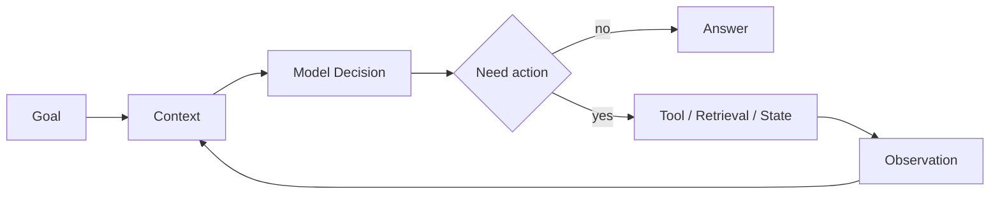

# Agent 总览与基础架构专题

> 先把 Agent 的能力边界学准，再学 RAG、Tool、Context 和 Workflow，否则很容易把“接了模型的应用”都叫 Agent。

## 一句话定义

Agent 是在目标、上下文和执行边界内，能基于观察进行多步决策并调用行动能力完成任务的系统。

## 为什么重要

- 它是整站 Agent 主线的起点。
- Chatbot、RAG、Workflow、Agent、Multi-Agent 的边界都从这里拆开。
- 面试开场题常从 Agent 定义和 Agentic Loop 开始。

## 学习闭环

| 顺序 | 页面 | 学什么 |
| :--- | :--- | :--- |
| 1 | [初学者版](00_核心概念初学者版.md) | 先把常见名词讲明白 |
| 2 | [学习与答题页](01_核心概念与面试答题模板.md) | 定义、Loop、ReAct、Function Call |
| 3 | [ReAct 代码实践](02_ReAct_Agent_代码实践.md) | 看最小行动循环 |
| 4 | [Multi-Agent 协作实践](03_MultiAgent_协作实践.md) | 看拆角色后的协作成本 |
| 5 | [高频八股](05_Agent基础高频八股.md) | 压成口述答案 |
| 6 | [真题与工程追问](06_Agent基础真题与工程追问.md) | 练边界和项目表达 |

## 结构图



## 记忆口诀

```text
有目标
有观察
会行动
会收口
才像 Agent
```

## 相关题目

- [Agent 基础高频题](05_Agent基础高频八股.md)
- [Agent 基础真题与工程追问](06_Agent基础真题与工程追问.md)
- [继续学习 Tool 与 MCP](../09_Tool与MCP工程实践/index.md)
