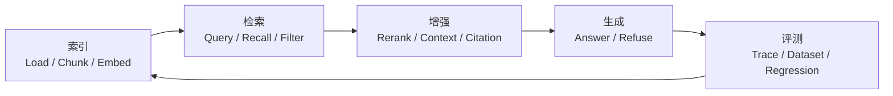

# RAG 检索工程专题学习页

> 本页负责把 RAG 原理讲清楚。背题请转到 [RAG 高频八股](03_RAG高频八股.md)，练工程追问请转到 [RAG 真题与工程追问](04_RAG真题与工程追问.md)。

## 一句话定义

RAG 是把外部证据检索、上下文增强和答案生成组织成一条可评测链路的检索增强生成方案。

## 为什么重要

- 参数知识会陈旧，外部资料会持续变化。
- 业务答案常要求引用、权限过滤和可追溯证据。
- Agent 需要把“查到什么”与“怎么行动”拆开，否则错误很难定位。

## 先修知识

| 先修 | 为什么需要 |
| :--- | :--- |
| Context Window | 理解证据最终放进哪里 |
| Embedding | 理解语义召回为什么可行 |
| Prompt | 理解回答约束和拒答策略 |
| Eval 与 Trace | 理解如何把失败样本回流 |

## 核心原理

### 1. RAG 四阶段流程



| 阶段 | 核心输入 | 核心输出 | 典型失败 |
| :--- | :--- | :--- | :--- |
| 索引 | 原始文档 | 可检索片段与元数据 | OCR 乱、切分碎、版本乱 |
| 检索 | 用户问题 | 候选证据 | 漏召回、权限错、实体词不准 |
| 增强 | 候选证据 | 最终上下文 | 噪声多、引用断、上下文超预算 |
| 生成 | 问题与证据 | 答案、引用、拒答 | 错归纳、乱补全、不肯拒答 |

### 2. Embedding 与 Chunk

| 优化点 | 说明 |
|--------|------|
| **模型选型** | 先根据语种、长度、成本和基准样本做比较，不把模型名当答案 |
| **领域适配** | 专业术语密集时要用领域样本验证召回质量，必要时再考虑适配 |
| **Chunk 策略** | 固定长度（如 512 token）/ 按语义切分 / 按段落切分 / 重叠滑动窗口；面试常问：Chunk 太大检索粒度粗，太小上下文割裂 |
| **多粒度索引** | 同时索引句子级（精细）和段落级（完整），检索时融合两者结果 |

### 3. 检索层优化

| 技术 | 原理 | 面试关键词 |
|------|------|------------|
| **混合检索** | 语义检索（向量相似度）+ BM25 关键词检索，两者结果融合 | Hybrid Search、α 权重 |
| **动态 α 调整** | 实体类查询（如"某公司法条"）α=0.3（关键词权重高）；分析类查询（如"总结趋势"）α=0.7（语义权重高） | 路由/分类模型决定 α |
| **重排序 Reranker** | 先召回 top_100，再用轻量模型（如 bge-reranker）精排取 top_5 | 两阶段检索、精排 |
| **查询改写** | 用改写、扩展或拆解降低原始 query 的歧义 | Query Expansion、HyDE |

### 4. 缓存与更新

| 层级 | 实现 | 用途 |
|------|------|------|
| **内存缓存** | Python dict / LRU Cache | 热点 query，微秒级响应 |
| **Redis 缓存** | Key=query_hash, Value=answer | 跨会话共享，秒级 TTL |
| **磁盘缓存** | 本地文件 / SQLite | 离线场景，防重复生成 |
| **失效策略** | 基于 TTL + 内容变化检测 | 知识库更新时主动失效 |

### 5. 评估指标

| 指标 | 含义 | 适用场景 |
|------|------|----------|
| **命中率 Hit Rate** | 正确答案是否在检索结果中 | 检索阶段 |
| **MRR** | 第一个正确答案的排名倒数均值 | 检索阶段 |
| **NDCG** | 考虑排序位置的相关性加权得分 | 检索阶段 |
| **精确率/召回率** | 检索结果中相关文档比例 / 所有相关文档被检索到的比例 | 检索阶段 |
| **答案正确率** | LLM 生成答案的事实正确性 | 生成阶段 |
| **忠实度 Faithfulness** | 答案是否忠实于检索到的上下文（有无 hallucination） | 生成阶段 |

## 工程实践

把上面的链路放进代码时，至少要找到这些落点：

| 工程节点 | 你要检查什么 |
| :--- | :--- |
| 文档接入 | 清洗、元数据、版本和权限标签 |
| 索引 | chunk 策略、embedding、索引更新 |
| 在线检索 | top_k、过滤、Hybrid、Rerank |
| 回答 | 引用绑定、拒答、上下文预算 |
| 观测 | Trace、失败样本、评测集回归 |

最小实现可直接看 [RAG 完整链路代码实践](02_RAG完整链路_代码实践.md)。

## 常见误区

| 误区 | 修正 |
| :--- | :--- |
| 只调 Prompt 就能修 RAG | 先确认正确证据有没有进上下文 |
| 向量检索就是 RAG 全部 | 文档治理、上下文组织和评测同样关键 |
| top_k 越大越稳 | 证据更多也可能带来噪声和延迟 |
| 只看最终答案 | 检索指标和答案指标要分层看 |

## 面试训练入口

- 需要短答案：进入 [RAG 高频八股](03_RAG高频八股.md)。
- 需要练排障：进入 [RAG 真题与工程追问](04_RAG真题与工程追问.md)。

## 高频问法入口

| 你想练什么 | 去哪里 |
| :--- | :--- |
| 快速说清 RAG、Chunk、Hybrid、Rerank | [RAG 高频八股](03_RAG高频八股.md) |
| 排查召回错、引用错、拒答错 | [RAG 真题与工程追问](04_RAG真题与工程追问.md) |
| 把链路映射回实现 | [RAG 完整链路代码实践](02_RAG完整链路_代码实践.md) |

## 记忆口诀与速查

```text
接资料，切证据
先召回，再精排
摆上下文，绑引用
分层评测，失败回流
```

## 面试冲刺检查清单

- [ ] 能画出 RAG 四阶段完整链路图
- [ ] 能说出 Embedding 选型至少要看哪些约束
- [ ] 能描述 Chunk 切分的 3 种策略及优缺点
- [ ] 能解释混合检索的原理和 α 动态调整策略
- [ ] 能说清两阶段检索（召回+精排）的设计原因
- [ ] 能列举 RAG 的 4+ 个评估指标
- [ ] 能描述多级缓存架构的设计

## 参考阅读

- [Retrieval-Augmented Generation 原始论文](https://arxiv.org/abs/2005.11401)
- [LangChain Retrieval 文档](https://docs.langchain.com/oss/python/langchain/retrieval)
