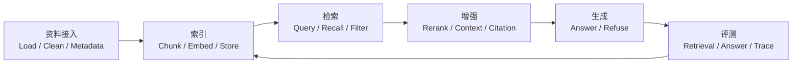

# RAG 检索工程专题

> RAG 专题按 `知识点 -> 实践 -> 八股 -> 真题追问` 组织。先把链路学清楚，再把答案压短，最后用追问检验工程理解。

## 一句话定义

RAG 是在生成答案前先从外部知识源检索证据，再把证据组织进上下文中辅助模型回答的工程链路。

## 为什么先学 RAG

RAG 是 Agent 工程里最容易形成完整闭环的专题：

| 学习层 | 要回答的问题 | 页面 |
| :--- | :--- | :--- |
| 知识点 | 文档怎样从原始资料变成可检索证据 | [专题学习页](01_核心概念与面试答题模板.md) |
| 实践 | 索引、检索、增强、生成怎样在代码里串起来 | [完整链路代码实践](02_RAG完整链路_代码实践.md) |
| 八股 | 面试时如何快速说清定义、链路和取舍 | [RAG 高频八股](03_RAG高频八股.md) |
| 真题追问 | 面对效果差、证据错、引用乱时如何定位 | [RAG 真题与工程追问](04_RAG真题与工程追问.md) |

## 先修知识

- Context Window：模型当前能看到什么。
- Embedding：文本怎样映射为可比较的向量表示。
- Prompt 与结构化输出：检索证据怎样进入回答约束。
- 基础评测：为什么要把检索质量和生成质量拆开看。

## 学习闭环

## 本专题最该记住的三件事

1. RAG 的核心不是“接一个向量库”，而是让证据在检索、组织、生成和评测中都可控。
2. 检索错和生成错要分开定位，否则优化动作会互相打架。
3. 面试回答要能从 `Chunk -> Recall -> Rerank -> Context -> Citation -> Eval` 顺着讲下去。

## 学完后去哪里

- 想理解 RAG 与长上下文、Memory 的边界：回到 [学习地图](../学习地图.md) 的 Context 阶段。
- 想把知识挂到项目复盘：进入 [项目实战与复盘](../../项目实战与复盘/index.md)。
- 想继续连接外部能力：进入 [Tool 与 MCP 专题](../09_Tool与MCP工程实践/index.md)。

## 相关题目

- [RAG 高频题](03_RAG高频八股.md)
- [RAG 真题与工程追问](04_RAG真题与工程追问.md)
- [继续学习 Tool 与 MCP](../09_Tool与MCP工程实践/index.md)
