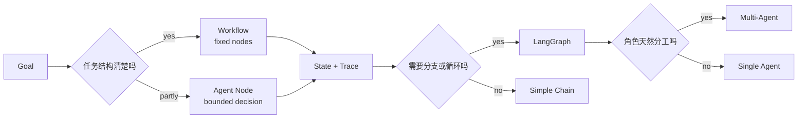

# Workflow、LangGraph 与 Multi-Agent 专题

> 编排层要解决的问题不是“框架 API 怎么背”，而是任务何时走固定流程，何时交给 Agent 决策，何时才值得拆成多 Agent。

## 一句话定义

Workflow 是显式控制步骤的执行流，Agent 是让模型在边界内决定下一步，LangGraph 是适合表达状态、分支、循环和人工中断的图编排方式。

## 为什么重要

- RAG、Tool、Memory 都只是能力，复杂任务还需要把能力排成可恢复的流程。
- 生产系统需要状态、退出条件、重试、人审和 Trace，而不是无限自由循环。
- Multi-Agent 会放大通信和错误传播成本，必须先理解单 Agent 与 Workflow。

## 先修知识

| 先修 | 作用 |
| :--- | :--- |
| Agent Loop | 理解模型驱动的循环 |
| Tool Calling | 理解行动节点 |
| Context 与 Memory | 理解状态与上下文预算 |
| Eval 与 Trace | 理解编排后的失败定位 |

## 学习闭环

| 顺序 | 页面 | 重点 |
| :--- | :--- | :--- |
| 1 | [学习页](01_核心概念与面试答题模板.md) | Workflow、LangChain、LangGraph 边界 |
| 2 | [代码实践](02_LangGraph_多Agent工作流.md) | State、Node、Edge、Router |
| 3 | [高频八股](03_Workflow与LangGraph高频八股.md) | 固定流程与图编排短答案 |
| 4 | [真题与工程追问](04_Workflow与LangGraph真题与工程追问.md) | 循环、HITL、多 Agent 取舍 |

## 结构图



## 记忆口诀

```text
流程清楚先 Workflow
决策开放再 Agent
分支循环用 Graph
角色分明才多 Agent
```

## 参考阅读

- [LangGraph Workflows and Agents](https://docs.langchain.com/oss/python/langgraph/workflows-agents)
- [LangGraph Overview](https://docs.langchain.com/oss/python/langgraph/overview)

## 相关题目

- [Workflow 与 LangGraph 高频题](03_Workflow与LangGraph高频八股.md)
- [Workflow 与 LangGraph 真题与工程追问](04_Workflow与LangGraph真题与工程追问.md)
- [继续学习 Eval、Trace 与 Safety](../11_EvalTraceSafety/index.md)
