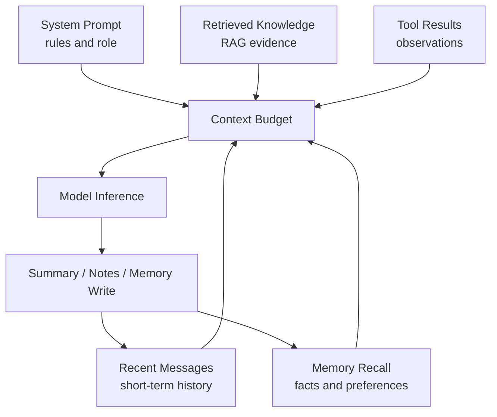

# Context 与 Memory 工程专题

> Context 决定模型这一次推理能看到什么，Memory 决定哪些历史信息值得在未来再被取回。

## 一句话定义

Context Engineering 是在有限上下文预算内选择、压缩、组织和回收高价值信息的工程方法。

## 为什么重要

- Agent 不是一次问答，工具结果、历史决策和任务状态会持续膨胀。
- 长上下文窗口并不等于有效上下文，噪声仍会稀释关键信号。
- RAG、Memory、Tool Result、Prompt 都会争夺同一份上下文预算。

## 先修知识

| 先修 | 作用 |
| :--- | :--- |
| Token 与 Context Window | 理解容量和成本边界 |
| Agent Loop | 理解上下文怎样在多轮执行中膨胀 |
| RAG | 理解动态检索与外部知识 |
| Tool Calling | 理解工具结果为什么要筛选和压缩 |

## 学习闭环

| 顺序 | 页面 | 重点 |
| :--- | :--- | :--- |
| 1 | [Context 学习页](01_Context工程核心概念与面试考点.md) | 预算、压缩、结构化笔记、检索 |
| 2 | [Context 压缩实践](02_Context压缩与总结实践.md) | 长会话如何收口 |
| 3 | [结构化笔记与持久化记忆](03_结构化笔记与持久化记忆.md) | 任务状态如何写到上下文外 |
| 4 | [动态上下文检索实践](04_动态上下文检索实践.md) | 只取当前相关信息 |
| 5 | [Memory 专题页](../02_记忆系统/01_核心概念与面试答题模板.md) | 短期记忆与长期记忆边界 |
| 6 | [Context 与 Memory 八股](05_Context与Memory高频八股.md) | 压成口述答案 |
| 7 | [真题与工程追问](06_Context与Memory真题与工程追问.md) | 练长任务排障 |

## 核心结构图



## 最容易混的边界

| 概念 | 主要职责 |
| :--- | :--- |
| Context Window | 本轮推理的输入容器 |
| Prompt | 指令和任务约束 |
| Memory | 可在未来被取回的历史信息 |
| RAG | 面向外部知识的检索增强 |
| Notes / State | 长任务中可持久化的工作记录 |

## 记忆口诀

```text
先定预算
再筛信息
近事保原文
远事做摘要
长期记忆按需取
```

## 参考阅读

- [Anthropic: Effective context engineering for AI agents](https://www.anthropic.com/engineering/effective-context-engineering-for-ai-agents)
- [LangGraph Memory 文档](https://docs.langchain.com/oss/python/langgraph/add-memory)

## 相关题目

- [Context 与 Memory 高频题](05_Context与Memory高频八股.md)
- [Context 与 Memory 真题与工程追问](06_Context与Memory真题与工程追问.md)
- [继续学习 RAG 专题](../03_RAG检索增强/index.md)
