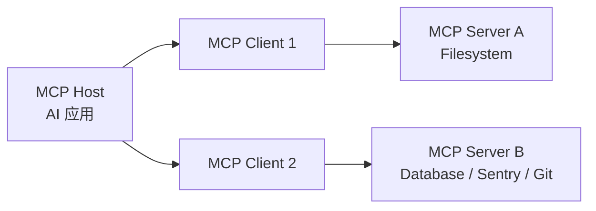

# 02 | MCP 协议核心概念：把 AI 工具接入做成统一插座

## 1. 先用一句话说人话

MCP 可以理解为“AI 应用连接外部工具和资料的统一插座标准”。有了 MCP，不同工具不需要为每个 Agent 框架单独写一套接入逻辑。

---

## 2. 为什么需要 MCP

没有 MCP 时，每个 AI 应用都要自己适配各种工具：

```text
Cursor 接数据库：写一套
Claude Desktop 接数据库：再写一套
自研 Agent 接数据库：又写一套
```

这会导致工具接入混乱、复用性差、权限和安全难管理。

MCP 的目标是让工具像 USB 设备一样，用统一协议接入不同 AI 应用。

---

## 3. 用生活类比理解

| 生活场景 | MCP 对应概念 |
|---|---|
| 电脑 | MCP Host |
| USB 接口管理器 | MCP Client |
| U 盘、鼠标、键盘 | MCP Server |
| 鼠标能点击、键盘能输入 | Tools |
| U 盘里的文件 | Resources |
| 快捷操作模板 | Prompts |

你不用关心每个设备内部怎么实现，只要它遵守 USB 标准，电脑就能识别。MCP 对 AI 工具也是类似思路。

---

## 4. MCP 三类参与者



| 角色 | 说明 |
|------|------|
| MCP Host | AI 应用本体，如 Claude Desktop、Claude Code、IDE、Agent 平台 |
| MCP Client | Host 内部为每个 Server 创建的连接管理组件 |
| MCP Server | 对外提供工具、资源、提示词的服务程序 |

---

## 5. MCP Server 暴露什么

| 能力 | 作用 | 示例 |
|------|------|------|
| Tools | 可执行动作 | 查询数据库、调用 API、创建 issue |
| Resources | 可读取上下文资源 | 文件、日志、网页、数据库记录 |
| Prompts | 可复用提示词模板 | 生成 commit message、代码审查模板 |

---

## 6. Tool、Function Call、MCP 的区别

这三个最容易混：

| 概念 | 人话解释 | 例子 |
|---|---|---|
| Tool | 一个具体能力 | 查数据库、读文件、搜索网页 |
| Function Call | 模型调用工具时填写的结构化请求 | `{\"name\":\"search\", \"arguments\":{...}}` |
| MCP | 把工具、资源、提示词统一暴露给 AI 应用的协议 | 一个 Filesystem MCP Server |

| 对比项 | Function Calling | MCP |
|--------|------------------|-----|
| 关注点 | 单次工具调用格式 | 工具、资源、提示词的标准连接协议 |
| 工具来源 | 通常在应用代码里写死 | 可由多个 MCP Server 动态提供 |
| 架构 | LLM App 内部函数 | Host-Client-Server 架构 |
| 复用性 | 跨应用复用较弱 | 同一个 MCP Server 可被多个 Host 使用 |
| 工程价值 | 让模型能调用函数 | 让 Agent 生态标准化接入外部系统 |

---

## 7. Transport：stdio 与 Streamable HTTP

| Transport | 适用场景 | 特点 |
|-----------|----------|------|
| stdio | 本地工具、本地文件、开发环境 | 简单、低延迟、通常一对一连接 |
| Streamable HTTP | 远程服务、企业 API、多客户端 | 适合云服务和多用户场景 |

---

## 8. 安全风险：为什么 MCP 不能随便接

| 风险 | 说明 | 防护 |
|------|------|------|
| 本地文件越权 | Filesystem Server 可能读取敏感文件 | 限制 roots、最小权限 |
| 命令执行风险 | 工具可能执行 shell 命令 | 沙箱、白名单、人审 |
| Token 泄露 | 工具结果或日志暴露密钥 | Secret 扫描、脱敏 |
| SSRF | 远程 Server 被诱导访问内部网络 | URL 校验、网络隔离 |
| Confused Deputy | 恶意服务诱导客户端用错误权限访问资源 | OAuth audience、资源绑定 |

---

## 9. 面试怎么回答

### 30 秒版

MCP 是连接 LLM 应用和外部工具、资源、提示词的标准协议。它采用 Host-Client-Server 架构，Server 暴露 Tools、Resources、Prompts，Host 通过 Client 连接 Server。它比普通 Function Calling 更完整，解决的是工具接入标准化和复用问题。

### 2 分钟版

MCP 解决的是 Agent 工程化中的工具接入混乱问题。Function Calling 更像一次工具调用的格式，而 MCP 是一套连接协议。AI 应用作为 MCP Host，会为每个 MCP Server 创建 MCP Client，Server 负责暴露工具、资源和提示词。比如文件系统、数据库、监控平台都可以做成 MCP Server，被不同 AI 应用复用。工程上要关注权限隔离、传输方式、安全审计和工具调用日志，尤其是本地文件和命令执行类工具要做最小权限和人工确认。

---

## 10. 常见追问

### Q1：MCP 是不是替代 RAG？

不是。RAG 是检索增强生成，重点是查知识；MCP 是工具和资源接入协议。MCP Server 可以提供资源给 RAG 用，但它们不是同一层东西。

### Q2：MCP 是不是就是 Function Calling？

不是。Function Calling 是调用格式，MCP 是 Host、Client、Server、Tools、Resources、Prompts、Transport 等一整套协议。

### Q3：为什么 MCP 有安全风险？

因为 MCP Server 可能访问本地文件、数据库、命令行或远程 API。如果权限不控制好，Agent 可能误读敏感文件或执行危险操作。

---

## 11. 自检清单

- [ ] 能解释 Host / Client / Server 三个角色
- [ ] 能说清 Tools / Resources / Prompts 的区别
- [ ] 能比较 stdio 和 Streamable HTTP
- [ ] 能说明 MCP 和 Function Calling 的区别
- [ ] 能列出至少 3 个 MCP 安全风险
