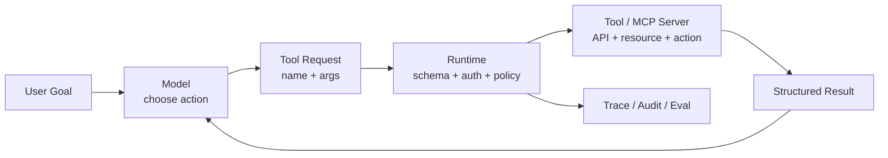

# Tool Calling 与 MCP 专题

> 这个专题研究一件事：模型怎样从“生成下一段文本”走到“受控地使用外部能力”。

## 一句话定义

Tool Calling 是模型提出结构化工具调用请求、应用运行时负责校验与执行的闭环；MCP 是 AI 应用连接工具、资源和提示词的标准协议。

## 为什么重要

- 没有 Tool，Agent 很难查实时数据、读业务系统或执行动作。
- 没有运行时边界，工具调用会把模型错误放大成真实副作用。
- 没有标准接入层，多个 Host 和外部能力会形成重复适配与治理碎片。

## 先修知识

- JSON Schema 与结构化输出。
- API、权限、超时、重试和幂等。
- Agent 主循环中“观察 -> 决策 -> 行动 -> 观察”的状态流转。

## 学习闭环

| 学习页 | 目标 |
| :--- | :--- |
| [Tool 设计原则与容错](01_Tool设计原则与容错.md) | 学会描述能力、约束参数、处理失败 |
| [MCP 协议核心概念](02_MCP协议核心概念.md) | 看懂 Host、Client、Server 和能力暴露 |
| [Tool 与 MCP 高频八股](03_Tool与MCP高频八股.md) | 把概念边界压成短答案 |
| [Tool 与 MCP 真题与工程追问](04_Tool与MCP真题与工程追问.md) | 练安全、可靠性和系统取舍 |

## 核心结构图



## 常见误区

| 误区 | 更稳的理解 |
| :--- | :--- |
| 模型会调用工具，所以模型负责执行 | 模型负责生成意图，运行时负责权限与副作用 |
| Tool Schema 只是参数说明 | Schema 还是参数边界、容错和评测基础 |
| MCP 就是 Function Calling | Function Calling 关注一次调用结构，MCP 关注连接协议 |
| 接上工具就等于工程化 | 还要做安全、审计、失败恢复和观测 |

## 速查总结

```text
Tool 看能力包装
Schema 看输入边界
Runtime 看执行控制
MCP 看标准连接
Safety 看权限与副作用
```

## 下一步

- 还没学检索证据链：先看 [RAG 专题](../03_RAG检索增强/index.md)。
- 准备进入编排：继续看 [Agent 规划与 Skill](../10_Agent规划与Skill/index.md)。

## 参考阅读

- [OpenAI Function Calling 文档](https://platform.openai.com/docs/guides/function-calling)
- [MCP Architecture](https://modelcontextprotocol.io/docs/learn/architecture)
- [MCP Server Concepts](https://modelcontextprotocol.io/docs/learn/server-concepts)
