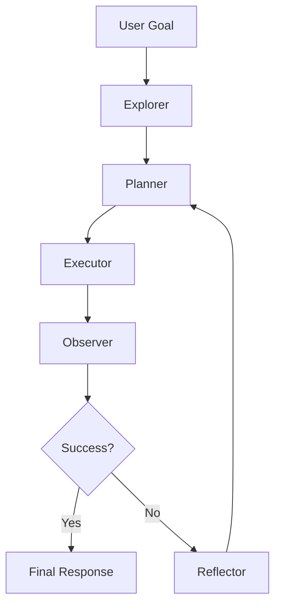

# 01 | Explore-Plan-Act 决策框架：让 Agent 不要一上来就乱干

## 1. 先用一句话说人话

Explore-Plan-Act 就是让 Agent 像靠谱的人一样做事：先了解情况，再列计划，然后执行，最后看结果对不对。

---

## 2. 为什么需要它

如果 Agent 一上来就执行，很容易出错：

- 需求没问清楚就开始改代码
- 文件没读完就下结论
- 工具结果失败了还继续往下做
- 计划不对却一直重复同一个错误

Explore-Plan-Act 的作用就是让 Agent 做复杂任务时更稳。

---

## 3. 用生活类比理解

假设老板让实习生“优化一个项目”：

| 阶段 | 实习生会做什么 | Agent 对应动作 |
|---|---|---|
| Explore | 先看项目结构、问清目标 | 读取文件、搜索资料、确认约束 |
| Plan | 写一个 todo list | 拆任务、排顺序、定验收标准 |
| Act | 按步骤修改和执行 | 调工具、写代码、运行测试 |
| Observe | 看结果是否成功 | 检查工具返回、测试结果 |
| Reflect | 失败后复盘原因 | 分析错误、重新规划 |

所以它不是神秘算法，而是一套“别莽，先搞清楚再做”的工作方法。

---

## 4. 与 ReAct 的关系

| 框架 | 核心流程 | 适用场景 |
|------|----------|----------|
| ReAct | Thought → Act → Observe | 短任务、工具调用链较短 |
| Plan-and-Execute | Plan → Execute → Replan | 中长任务、步骤明确 |
| Explore-Plan-Act | Explore → Plan → Act → Observe/Reflect | 信息不完整、需要动态探索的复杂任务 |

ReAct 更像“边想边做”，Plan-and-Execute 更像“先列计划再执行”，Explore-Plan-Act 则强调在规划前先搞清环境和约束。

---

## 5. 五个核心阶段

### 1. Explore：探索

目标是收集上下文，澄清问题边界。它回答的是：“我现在到底面对什么情况？”

典型动作：

- 读取文件、数据库、网页、日志
- 检索相关文档
- 询问用户缺失信息
- 判断可用工具和约束条件

### 2. Plan：规划

把复杂目标拆成可执行步骤。它回答的是：“我接下来按什么顺序做？”

优秀计划应包含：

- 子任务列表
- 执行顺序
- 所需工具
- 验收标准
- 失败回退方案

### 3. Act：执行

调用工具、写代码、查询数据、修改系统状态。它回答的是：“我要具体做哪一步？”

关键要求：

- 每次动作有明确目的
- 危险动作需要确认
- 工具结果要结构化保存
- 写操作尽量幂等

### 4. Observe：观察

读取执行结果，判断是否达成目标。它回答的是：“刚才那一步成功了吗？”

观察内容包括：

- 工具返回是否成功
- 输出是否符合 schema
- 测试是否通过
- 用户目标是否满足

### 5. Reflect / Replan：反思与重规划

当结果不符合预期时，需要分析原因并调整计划。它回答的是：“为什么失败？下一步要怎么改？”

常见原因：

- 初始信息不足
- 工具失败
- 计划顺序错误
- 中间假设不成立

---

## 6. 技术流程图

---

## 7. 面试怎么回答

### 30 秒版

Explore-Plan-Act 是复杂任务中的 Agent 决策框架。Explore 先收集信息和约束，Plan 把目标拆成步骤，Act 执行工具或动作，Observe 检查结果，如果失败就 Reflect 并重新规划。

### 2 分钟版

复杂任务不能只靠模型单轮回答，因为一开始信息可能不完整。Explore 阶段先读取上下文、检索资料、确认用户目标和可用工具；Plan 阶段把目标拆成子任务，并明确执行顺序、工具选择和验收标准；Act 阶段逐步执行；Observe 阶段读取工具返回或测试结果；如果结果不符合预期，就 Reflect 分析失败原因并 Replan。生产环境还需要最大迭代次数、工具超时、失败记录和人工确认，避免死循环和危险操作。

---

## 8. 和相似概念的区别

| 概念 | 人话区别 |
|---|---|
| ReAct | 每一步都“想一下、做一下、看一下”，适合短链路任务 |
| Plan-and-Execute | 先列计划再执行，适合步骤明确的任务 |
| Explore-Plan-Act | 先探索环境再规划，适合信息不完整的复杂任务 |
| LangGraph | 可以用图结构把这些流程工程化实现 |

---

## 9. 常见坑点

| 坑点 | 解决方案 |
|------|----------|
| 一开始就执行，缺少探索 | 先读取上下文和约束 |
| 计划太长，执行中失效 | 分阶段计划，动态 Replan |
| 工具失败导致全局失败 | 加重试、降级、替代工具 |
| 无停止条件 | 设置完成标准和最大迭代次数 |
| 反复循环 | 记录失败原因，禁止重复无效动作 |

---

## 10. 常见追问

### Q1：为什么不直接 Plan？

因为一开始信息可能不完整。比如你没读代码库，就没法制定靠谱的重构计划。

### Q2：什么时候需要 Replan？

工具失败、测试失败、用户目标变化、发现新约束、原计划步骤不可行时，都要 Replan。

### Q3：怎么防止 Agent 死循环？

设置最大迭代次数，记录失败动作，连续失败后降级或询问用户，危险操作前要求确认。

---

## 11. 自检清单

- [ ] 能区分 ReAct、Plan-and-Execute、Explore-Plan-Act
- [ ] 能说清 Planner、Executor、Reflector 的职责
- [ ] 能解释什么时候需要 Replan
- [ ] 能给出防止死循环的策略
