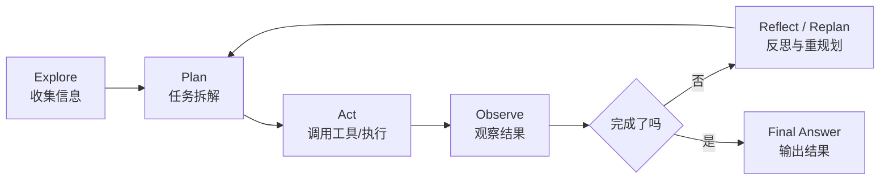

# 10 | Agent 规划与 Skill

> 这一章解决“Agent 如何自主做事”和“如何把行为能力沉淀成可复用 Skill”的问题。

---

## 本章学习目标

- 能解释 Explore / Plan / Act / Observe / Reflect 的决策链路
- 能区分 ReAct 和 Plan-and-Execute
- 能说明 Planner、Executor、Reflector 的职责
- 能区分 Tool 和 Agent Skill
- 能设计一个可复用 Skill 的结构

---

## 章节目录

| 页面 | 重点 |
|------|------|
| [Explore-Plan-Act 决策框架](01_Explore_Plan_Act决策框架.md) | Agent 如何探索、规划、执行和反思 |
| [Agent Skill 定制行为指南](02_AgentSkill定制行为指南.md) | Skill 与 Tool 的区别、注册、路由、评估 |

---

## Agent 自主大脑流程

---

## 高频面试问题

1. ReAct 和 Plan-and-Execute 有什么区别？
2. Agent 为什么需要 Planner？
3. 执行失败后怎么 Replan？
4. Skill 和 Tool 的区别是什么？
5. Skill 如何选择、组合和版本管理？
