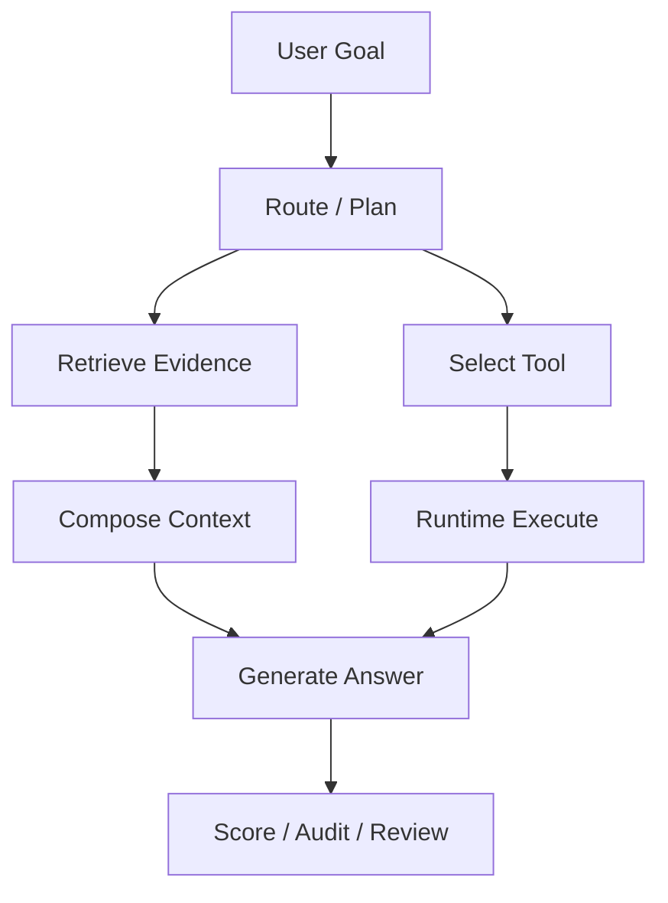

# Eval、Trace 与 Safety 学习页

## 一、先分清三件事

| 能力 | 解决的问题 | 典型产物 |
| :--- | :--- | :--- |
| Eval | 改动有没有变好 | case、score、report |
| Trace | 错在哪一层 | retrieval、tool、state、model spans |
| Safety | 错了能不能被拦住 | policy、auth、HITL、audit |

## 二、Eval：把质量判断从感觉变成回归

### 1. 评测集至少要覆盖什么

| 样本类型 | 为什么要有 |
| :--- | :--- |
| 正常成功任务 | 证明主路径可用 |
| 边界任务 | 证明系统知道能力边界 |
| 拒答或无证据任务 | 防止乱补全 |
| 工具失败任务 | 看恢复能力 |
| 高风险任务 | 看策略是否拦截 |

### 2. 指标要分层

| 层次 | 指标示例 |
| :--- | :--- |
| 检索 | Recall@K、证据相关性、引用命中 |
| 工具 | Tool Selection Accuracy、参数正确率、调用成功率 |
| 任务 | Pass@1、最终完成率、自我修正后成功率 |
| 系统 | 延迟、成本、重试次数、人工介入率 |

## 三、Trace：把失败链路拆开

一次 Agent Trace 至少应能回答：

1. 用户目标是什么。
2. 当前进入了哪个节点或状态。
3. 检索拿回了什么证据。
4. 模型选择了哪个工具和参数。
5. 工具返回了什么结果或错误。
6. 系统为什么重试、停止、拒答或进入人工确认。



## 四、Safety：边界放在执行层

| 风险 | 执行层防护 |
| :--- | :--- |
| Prompt Injection | 不信任外部文本指令，工具与资源做权限隔离 |
| 参数越界 | Schema、范围校验、allowlist |
| 写操作重复 | 幂等键、版本检查、回滚 |
| 高风险动作 | 预览、人审、审计 |
| 敏感信息外泄 | 最小权限、脱敏、日志策略 |

!!! warning "关键判断"
    Prompt 可以提示模型守规矩，但权限、审批、审计和真正执行动作必须由系统负责。

## 五、工程实践

一个最小治理面板可以先记录：

```text
case_id
task_type
retrieved_context_ids
selected_tool
tool_args_valid
tool_result_status
retry_count
final_answer_grade
latency_ms
token_usage
safety_decision
```

## 六、常见误区

| 误区 | 修正 |
| :--- | :--- |
| 只看最终答案对不对 | 还要看证据、工具和副作用 |
| Trace 等于日志越多越好 | Trace 要能按节点定位失败 |
| Prompt 写严一点就安全 | 执行层才是边界 |
| 没有失败样本也能优化 | 失败 taxonomy 是迭代入口 |

## 七、继续训练

- [Eval、Trace 与 Safety 高频八股](02_EvalTraceSafety高频八股.md)
- [Eval、Trace 与 Safety 真题追问](03_EvalTraceSafety真题与工程追问.md)
