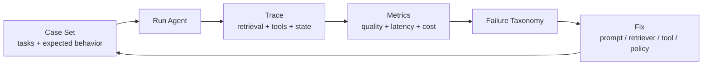

# Eval、Trace 与 Safety 专题

> Agent 系统能演示，不等于能上线。Eval 证明改动是否有效，Trace 解释失败发生在哪里，Safety 限制错误能造成多大副作用。

## 一句话定义

Eval、Trace 与 Safety 是 Agent 的治理层：分别负责质量回归、链路观测和执行边界。

## 为什么重要

- LLM 输出有波动，不能只靠一次 Demo 判断质量。
- Agent 失败常跨越检索、工具、状态和生成多个节点。
- Prompt 不是安全边界，高风险动作必须在执行层收口。

## 先修知识

| 先修 | 原因 |
| :--- | :--- |
| RAG | 检索和回答要分层评测 |
| Tool Calling | 工具选择、参数和副作用要观测 |
| Workflow / Agent Loop | 看懂节点、重试和退出条件 |
| 基础安全 | 最小权限、审计、人工确认 |

## 治理闭环



## 页面顺序

| 顺序 | 页面 | 学什么 |
| :--- | :--- | :--- |
| 1 | [学习页](01_EvalTraceSafety学习页.md) | 指标、Trace、安全边界 |
| 2 | [高频八股](02_EvalTraceSafety高频八股.md) | 压成口述答案 |
| 3 | [真题与工程追问](03_EvalTraceSafety真题与工程追问.md) | 练回归、排障和治理 |
| 4 | [Harness 工程](../07_Harness工程深入/01_Harness核心理念与面试考点.md) | 看长任务执行环境 |

## 记忆口诀

```text
先有 case
再看 trace
指标分层
执行设界
失败回流
```

## 参考阅读

- [OpenAI Agent Evals](https://platform.openai.com/docs/guides/agent-evals)
- [OpenAI Trace Grading](https://platform.openai.com/docs/guides/graders)
- [OWASP LLM Prompt Injection Prevention Cheat Sheet](https://cheatsheetseries.owasp.org/cheatsheets/LLM_Prompt_Injection_Prevention_Cheat_Sheet.html)
