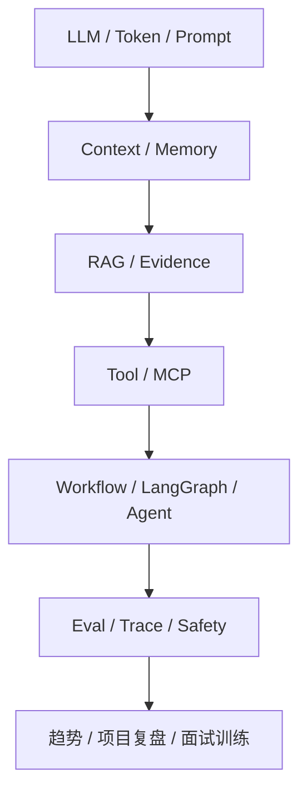

---
hide:
  - toc
---

# Agent 知识点总览

> Agent 主线先看知识点，再进入高频题和专题题页。代码实践与项目复盘用来验证理解，不替代专题学习。

## 知识点入口

| 模块 | 入口 | 重点 |
| :--- | :--- | :--- |
| LLM 与 Context 基础 | [底层框架全景图](00_AI底层框架全景图/index.md) | Token、Prompt、Context Window |
| Agent 基础 | [Agent 基础专题](01_Agent基础架构/index.md) | 定义、Loop、ReAct、Multi-Agent 边界 |
| Context 与 Memory | [Context 工程专题](08_Context工程/index.md) | 压缩、结构化笔记、记忆与检索 |
| RAG | [RAG 检索工程专题](03_RAG检索增强/index.md) | Chunk、召回、Rerank、引用、评测 |
| Tool 与 MCP | [Tool Calling 与 MCP 专题](09_Tool与MCP工程实践/index.md) | Schema、运行时、安全、协议 |
| Workflow 与 LangGraph | [编排专题](04_LangChain_LangGraph/index.md) | State、Node、Edge、HITL |
| Prompt 工程 | [Prompt 专题](06_Prompt工程与AI编程工具/01_核心概念与面试答题模板.md) | 结构化输出、parser、回归测试 |
| Eval、Trace 与 Safety | [治理专题](11_EvalTraceSafety/index.md) | 指标、链路观测、执行边界 |
| Planner 与 Skill | [Agent 规划与 Skill](10_Agent规划与Skill/index.md) | 决策框架与可复用行为 |
| 前沿与趋势 | [前沿趋势专题](12_前沿趋势/index.md) | Agentic RAG、MCP、多 Agent、成本、安全 |

## 题目入口

| 题型 | 入口 |
| :--- | :--- |
| 高频题总览 | [Agent 高频题总览](面试八股总览.md) |
| 公开真题 | [公开真题整理](公开面试题整理.md) |
| 工程追问 | [工程追问题库](../面试题库/工程追问题库.md) |
| 模拟面试 | [综合模拟面试题库](08_模拟面试题与答案/01_综合模拟面试题库.md) |

## 推荐进入顺序

1. 用 [学习地图](学习地图.md) 先看知识依赖。
2. 选一个专题，按“知识点 -> 实践 -> 高频题 -> 真题与追问”走完。
3. 需要项目表达时进入 [项目与代码实践](../项目实战与复盘/index.md)。

## 全景知识图

