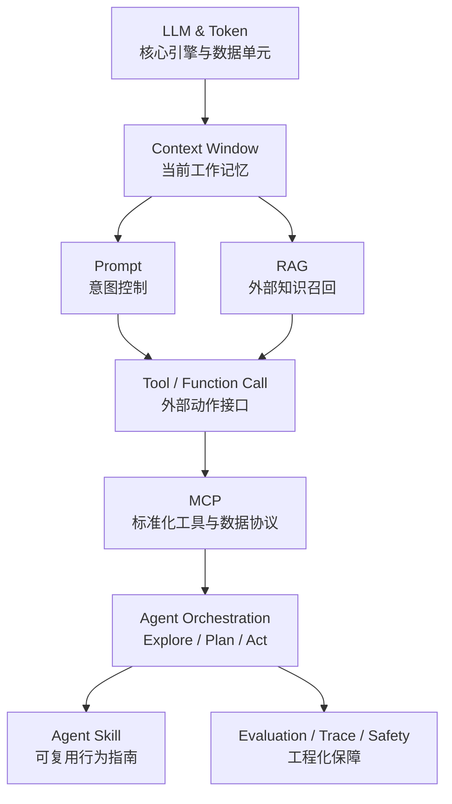

# AI Agent 面试实践总览

> 目标：从底层模型、上下文、工具协议到 Agent 编排、Skill 定制和工程评估，形成一条可用于面试表达和项目落地的完整知识链路。

---

## 一、推荐学习路径

### ① 底层框架全景

先建立整体地图：LLM & Token 是底座，Context Window 是工作台，Tool/MCP 是外部能力桥梁，Agent 是自主决策大脑。

[进入全景图](00_AI底层框架全景图/index.md){ .md-button }

### ② Agent 基础架构

先用初学者版理解 Agent、ReAct、Function Call、Multi-Agent、MCP，再看面试模板背答案。

[先看初学者版](01_Agent基础架构/00_核心概念初学者版.md){ .md-button }

### ③ Context / Memory / RAG

解决“模型当前看见什么、长期记住什么、外部知识怎么召回”的核心问题。

[学习 Context 工程](08_Context工程/01_Context工程核心概念与面试考点.md){ .md-button }

### ④ Tool / MCP / Skill

把 LLM 从文本生成器扩展为任务执行器，理解工具调用、MCP 标准协议和 Agent Skill 定制化。

[学习 Tool 与 MCP](09_Tool与MCP工程实践/index.md){ .md-button }

---

## 二、AI Agent 全景知识图

---

## 三、面试回答总模板

当面试官问“你怎么理解 AI Agent 系统架构？”可以按五层回答：

| 层级 | 核心组件 | 一句话回答 |
|------|----------|------------|
| **Structural** | LLM、Token、Tokenizer | 决定模型能力、成本和上下文上限 |
| **Container** | Context Window、Prompt、RAG | 决定模型当前能看见哪些信息 |
| **Bridge** | Tool、Function Call、MCP | 让模型连接外部系统并执行动作 |
| **Orchestration** | Agent、Planner、Executor | 决定任务如何拆解、执行和反馈 |
| **Customization** | Agent Skill、Rules、Workflow | 让 Agent 适配具体业务场景 |

---

## 四、当前模块索引

| 模块 | 重点 | 面试价值 |
|------|------|----------|
| 00 AI底层框架全景图 | 总架构、LLM & Token、Context Window | 建立体系，适合开场题 |
| 01 Agent基础架构 | ReAct、Function Call、Multi-Agent | 高频必考 |
| 02 记忆系统 | 短期记忆、长期记忆、分层存储 | 高频必考 |
| 03 RAG检索增强 | Embedding、Chunk、混合检索、Reranker | 高频必考 |
| 04 LangChain / LangGraph | 状态图、多 Agent 工作流 | 工程落地 |
| 05 模型微调与性能优化 | LoRA、量化、蒸馏、DPO | 加分项 |
| 06 Prompt工程 | Prompt 模板、CoT、AI 编程工具 | 高频基础 |
| 07 Harness工程 | 长任务 Agent、Subagent、测试 | 高阶区分度 |
| 08 Context工程 | Compaction、结构化笔记、动态检索 | 最新热点 |
| 09 Tool与MCP工程实践 | Tool Schema、MCP 架构、安全 | 2026 热点 |
| 10 Agent规划与Skill | Explore-Plan-Act、Skill 定制 | 高阶系统设计 |

---

## 五、建议冲刺顺序

1. **第一轮：先理解概念**：AI 系统分层总览 → LLM 与 Token → Context Window → Agent 初学者版
2. **第二轮：掌握高频基础**：Agentic Loop → ReAct → Function Call → Memory → RAG
3. **第三轮：理解工程化**：Tool/MCP → LangGraph → Explore-Plan-Act → Agent Skill
4. **第四轮：准备面试表达**：面试模板 → 高频追问 → 模拟面试题库
