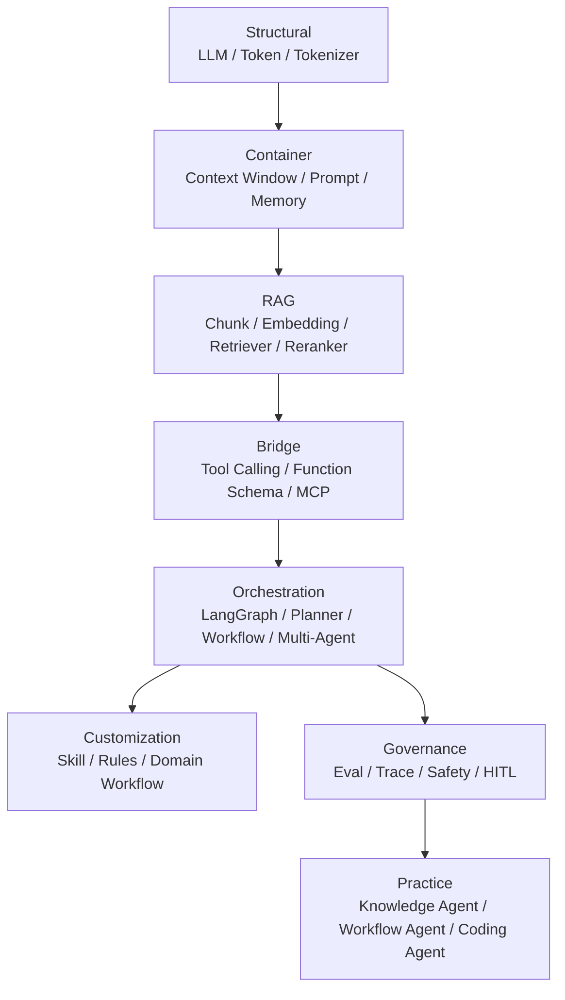

# AI Agent 面试实践总览

Agent Engineering Knowledge Map

<h1 class="hero-title">从概念背诵，升级为项目级系统表达</h1>

这套笔记围绕 Agent 工程能力组织：LLM 基础、RAG、Tool/MCP、LangGraph、上下文、记忆、评测、安全、Planner 与 Skill。

[进入学习地图](学习地图.md){ .md-button .md-button--primary }
[进入模拟面试题库](08_模拟面试题与答案/01_综合模拟面试题库.md){ .md-button }
[学习 Harness 工程](07_Harness工程深入/01_Harness核心理念与面试考点.md){ .md-button }

---

## 一、推荐学习路径

### ① 底层框架全景

先建立整体地图：LLM & Token 是底座，Context Window 是工作台，Tool/MCP 是外部能力桥梁，Agent 是自主决策大脑。

[进入全景图](00_AI底层框架全景图/index.md){ .md-button }

### ② Agent 基础架构

理解 Agent、ReAct、Function Call、Multi-Agent、MCP，再用项目例子把概念落地。

[学习 Agent 基础](01_Agent基础架构/00_核心概念初学者版.md){ .md-button }

### ③ Context / Memory / RAG

解决“模型当前看见什么、长期记住什么、外部知识怎么召回”的核心问题。

[学习 RAG 闭环示范](03_RAG检索增强/index.md){ .md-button }

### ④ 项目复盘入口

把 RAG、Tool、状态流转、评测和安全映射到可复用项目链路，避免只背零散概念。

[进入项目复盘](../项目实战与复盘/index.md){ .md-button }

### ⑤ Tool / MCP / Skill

把 LLM 从文本生成器扩展为任务执行器，理解工具调用、MCP 标准协议和 Agent Skill 定制化。

[学习 Tool 与 MCP](09_Tool与MCP工程实践/index.md){ .md-button }

### ⑥ Eval / Trace / Safety

面试高阶区分点：如何证明 Agent 有效、如何定位失败、如何控制高风险动作。

[学习 Harness 工程](07_Harness工程深入/01_Harness核心理念与面试考点.md){ .md-button }

---

## 二、AI Agent 全景知识图

---

## 三、专题学习闭环

核心专题统一按下面的顺序复习，先从 RAG 和 Tool/MCP 两个样板专题熟悉节奏：

| 顺序 | 学习动作 | RAG | Tool/MCP |
| :--- | :--- | :--- | :--- |
| 1 | 先看入口和依赖 | [RAG 专题](03_RAG检索增强/index.md) | [Tool/MCP 专题](09_Tool与MCP工程实践/index.md) |
| 2 | 再看原理页 | [RAG 学习页](03_RAG检索增强/01_核心概念与面试答题模板.md) | [Tool 学习页](09_Tool与MCP工程实践/01_Tool设计原则与容错.md) |
| 3 | 对照实现 | [RAG 代码实践](03_RAG检索增强/02_RAG完整链路_代码实践.md) | [MCP 学习页](09_Tool与MCP工程实践/02_MCP协议核心概念.md) |
| 4 | 压成八股 | [RAG 八股](03_RAG检索增强/03_RAG高频八股.md) | [Tool/MCP 八股](09_Tool与MCP工程实践/03_Tool与MCP高频八股.md) |
| 5 | 做真题追问 | [RAG 追问](03_RAG检索增强/04_RAG真题与工程追问.md) | [Tool/MCP 追问](09_Tool与MCP工程实践/04_Tool与MCP真题与工程追问.md) |

---

## 四、Agent 岗位能力矩阵

| 层级 | 核心组件 | 你要会讲 | 项目证据 |
| :--- | :--- | :--- | :--- |
| Structural | LLM、Token、Tokenizer | 模型怎么接收和生成文本，成本怎么计算 | Token 使用统计、结构化输出 |
| Container | Context、Prompt、Memory | 如何控制模型当前能看见什么 | 多轮会话、历史裁剪、Prompt 模板 |
| Retrieval | RAG、Embedding、Rerank | 如何把外部知识可靠注入模型 | 知识库 RAG、引用链路 |
| Bridge | Tool、Function Call、MCP | 模型如何连接数据库、搜索、文件、业务系统 | SQL 工具、安全执行器 |
| Orchestration | Agent、Planner、LangGraph | 如何拆解任务、路由节点、失败重试 | StateGraph、条件边、自愈循环 |
| Governance | Eval、Trace、Safety | 如何证明有效、定位问题、控制风险 | Eval Harness、metadata、SQL Guard |
| Productization | UI、Demo、部署、文档 | 如何把系统讲成产品而非脚本 | Streamlit 前端、README、项目复盘 |

---

## 五、当前模块索引

| 模块 | 重点 | 面试价值 |
|------|------|----------|
| 00 AI底层框架全景图 | 总架构、LLM & Token、Context Window | 建立体系，适合开场题 |
| 01 Agent基础架构 | ReAct、Function Call、Multi-Agent | 高频必考 |
| 02 记忆系统 | 短期记忆、长期记忆、分层存储 | 高频必考 |
| 03 RAG检索增强 | Embedding、Chunk、混合检索、Reranker | 高频必考 |
| 04 LangChain / LangGraph | 状态图、多 Agent 工作流 | 工程落地 |
| 05 模型微调与性能优化 | LoRA、量化、蒸馏、DPO | 加分项 |
| 06 Prompt工程 | Prompt 模板、CoT、AI 编程工具 | 高频基础 |
| 07 Harness工程 | 长任务 Agent、Subagent、测试 | 高阶区分度 |
| 08 Context工程 | Compaction、结构化笔记、动态检索 | 最新热点 |
| 09 Tool与MCP工程实践 | Tool Schema、MCP 架构、安全 | 2026 热点 |
| 10 Agent规划与Skill | Explore-Plan-Act、Skill 定制 | 高阶系统设计 |

---

## 六、面试回答总模板

当面试官问“你怎么理解 AI Agent 系统架构？”可以按五层回答：

1. **模型层**：LLM 提供语言理解、推理和生成能力，但不是完整系统。
2. **上下文层**：Prompt、Memory、RAG 决定模型当前能看到哪些信息。
3. **工具层**：Tool Calling / MCP 让模型能调用外部系统并执行动作。
4. **编排层**：LangGraph / Planner / Workflow 决定任务如何拆解、路由、重试和结束。
5. **治理层**：Eval、Trace、Safety、HITL 决定系统能否稳定上线和持续优化。

面试金句：

> 我理解的 Agent 不是“会聊天的模型”，而是“模型 + 上下文 + 工具 + 编排 + 治理”的系统工程。真正的难点不只是让模型回答，而是让它在真实业务系统里可执行、可观测、可回滚、可评测。

---

## 七、面试模拟题入口

如果已经理解上面的知识模块，可以直接进入模拟面试题库，用“定义 → 区分 → 原理 → 坑点 → 优化 → 项目举证”的结构练习口述答案。

[进入 AI Agent 综合模拟面试题库](08_模拟面试题与答案/01_综合模拟面试题库.md){ .md-button .md-button--primary }
