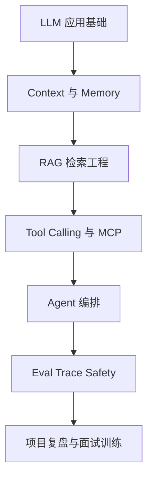

# AI Agent 工程学习地图

> 目标：先建立知识依赖，再进入专题、代码实践和面试训练。

## 一、先看整体结构

AI Agent 学习不适合从框架 API 开始。更稳的顺序是先理解模型能力边界，再学上下文和检索，之后连接工具与编排，最后补评测、安全和工程化。



## 二、六段学习路线

| 阶段 | 先学什么 | 学明白的标志 | 入口 |
| :--- | :--- | :--- | :--- |
| 1 | LLM、Token、Prompt、结构化输出 | 能解释模型为什么需要上下文、schema 和外部工具 | [底层框架全景图](00_AI底层框架全景图/index.md) |
| 2 | Context Window、Memory、压缩 | 能区分消息历史、摘要、长期记忆和检索上下文 | [Context 与 Memory](08_Context工程/index.md) |
| 3 | RAG、Chunk、Embedding、Rerank | 能画出索引到生成的完整链路，并说出失败点 | [RAG 专题](03_RAG检索增强/index.md) |
| 4 | Tool、Function Call、MCP | 能说清模型选工具与应用执行工具的边界 | [Tool 与 MCP](09_Tool与MCP工程实践/index.md) |
| 5 | ReAct、Workflow、LangGraph、Planner | 能解释何时用固定流程，何时让 Agent 决策 | [Agent 基础](01_Agent基础架构/00_核心概念初学者版.md) |
| 6 | Eval、Trace、Safety、HITL | 能用指标和调用链定位一次失败任务 | [Eval、Trace 与 Safety](11_EvalTraceSafety/index.md) |

## 三、每个专题怎么学

建议固定走五步：

1. **专题入口**：先看一句话定义、依赖关系和学习顺序。
2. **专题详解**：再看原理、流程图和常见坑点。
3. **代码实践**：确认数据、状态和边界在实现里怎样流动。
4. **八股压缩**：把长知识压成一段能稳定复述的答案。
5. **真题追问**：用故障定位、方案取舍和项目复盘检验理解。

RAG 与 Tool/MCP 已先按这套结构整理，可作为后续专题模板。

| 专题 | 专题入口 | 实践 | 八股 | 真题追问 |
| :--- | :--- | :--- | :--- | :--- |
| RAG | [入口](03_RAG检索增强/index.md) | [代码](03_RAG检索增强/02_RAG完整链路_代码实践.md) | [八股](03_RAG检索增强/03_RAG高频八股.md) | [追问](03_RAG检索增强/04_RAG真题与工程追问.md) |
| Agent 基础 | [入口](01_Agent基础架构/index.md) | [ReAct](01_Agent基础架构/02_ReAct_Agent_代码实践.md) | [八股](01_Agent基础架构/05_Agent基础高频八股.md) | [追问](01_Agent基础架构/06_Agent基础真题与工程追问.md) |
| Tool/MCP | [入口](09_Tool与MCP工程实践/index.md) | [Tool](09_Tool与MCP工程实践/01_Tool设计原则与容错.md) | [八股](09_Tool与MCP工程实践/03_Tool与MCP高频八股.md) | [追问](09_Tool与MCP工程实践/04_Tool与MCP真题与工程追问.md) |
| Context/Memory | [入口](08_Context工程/index.md) | [压缩](08_Context工程/02_Context压缩与总结实践.md) | [八股](08_Context工程/05_Context与Memory高频八股.md) | [追问](08_Context工程/06_Context与Memory真题与工程追问.md) |
| Workflow/LangGraph | [入口](04_LangChain_LangGraph/index.md) | [代码](04_LangChain_LangGraph/02_LangGraph_多Agent工作流.md) | [八股](04_LangChain_LangGraph/03_Workflow与LangGraph高频八股.md) | [追问](04_LangChain_LangGraph/04_Workflow与LangGraph真题与工程追问.md) |
| Eval/Safety | [入口](11_EvalTraceSafety/index.md) | [学习](11_EvalTraceSafety/01_EvalTraceSafety学习页.md) | [八股](11_EvalTraceSafety/02_EvalTraceSafety高频八股.md) | [追问](11_EvalTraceSafety/03_EvalTraceSafety真题与工程追问.md) |

## 四、知识依赖速查

| 当前卡住的问题 | 优先回补 |
| :--- | :--- |
| 不理解为什么工具调用要有 schema | 结构化输出、Function Calling |
| RAG 看懂概念但不会调效果 | Chunk、召回、Rerank、Eval |
| LangGraph 节点很多但链路混乱 | State、条件边、Workflow 与 Agent 区别 |
| 记忆越做越复杂 | Context Window、摘要、检索式记忆 |
| 项目能跑但讲不出可靠性 | Trace、指标、安全护栏、重试 |

## 五、学习输出模板

每学完一个知识点，至少留下这四句话：

```text
它是什么：
它解决什么问题：
项目里放在哪个节点：
面试被追问时先答什么：
```

## 六、核心专题统一结构

后续每个核心专题尽量按这十格整理：

| 结构 | 要解决的问题 |
| :--- | :--- |
| 一句话定义 | 先把边界说清 |
| 为什么重要 | 知道它解决哪类工程问题 |
| 先修知识 | 避免在依赖处卡住 |
| 核心原理 | 讲机制而不是只背名词 |
| 流程图或结构图 | 形成可复述图像 |
| 工程实践 | 找到代码、指标和失败点 |
| 常见误区 | 知道哪里最容易答偏 |
| 高频八股 | 压成稳定短答案 |
| 真题与追问 | 练排障和取舍 |
| 记忆口诀 | 最后做速查 |

## 七、下一步入口

- 想先形成全局框架：进入 [AI Agent 面试实践总览](index.md)
- 想先做项目联想：进入 [项目实战与复盘](../项目实战与复盘/index.md)
- 想先压缩成答案：进入 [Agent 面试八股总览](面试八股总览.md)
