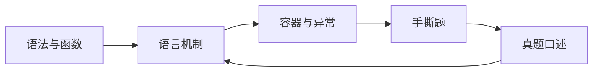

# Python 学习路线与刷题顺序

> Python 学习页服务两个目标：能写 Agent 工程代码，能在面试里把语言机制讲清楚。

## 一、四段路线

| 阶段 | 学什么 | 学会的标志 | 入口 |
| :--- | :--- | :--- | :--- |
| 1 | 变量、条件、循环、函数、字符串 | 能自己写小脚本并读懂函数调用 | [零基础入门](00_零基础入门/01_变量与数据类型.md) |
| 2 | 可变对象、装饰器、迭代器、生成器、GIL | 能解释 Python 高频语言题 | [语言特性](01_Python语言特性/01_核心概念与面试答题模板.md) |
| 3 | list、dict、set、异常、上下文管理 | 能为代码选择合适容器和错误边界 | [内置数据结构](02_数据结构与常用库/01_内置数据结构从入门到面试.md) |
| 4 | 异步、并发、工程边界 | 能把 I/O、GIL、异常和资源释放讲清 | [异步与并发](04_Python进阶面试题/01_异步与并发面试页.md) |
| 5 | 手撕题与口述 | 能边写边讲复杂度、边界和测试 | [高频手撕题](03_面试高频手撕题/01_最长不重复子串.md) |

## 二、学习闭环

## 三、Agent 工程里最常用的 Python 能力

| 能力 | 为什么常用 |
| :--- | :--- |
| 函数与类型提示 | Tool、节点和数据契约都依赖清晰接口 |
| `dict` / `list` | 消息、参数、状态流转的基础容器 |
| 异常处理 | 工具失败、重试和降级都要收口 |
| 生成器与异步思维 | 流式输出、任务调度和 I/O 并发常见 |
| 上下文管理 | 文件、连接和资源释放 |

## 四、面试前速查

1. 先刷 [Python 面试真题整理](面试真题整理.md)。
2. 答不顺的题回到对应知识页。
3. 每道手撕题都补三句话：思路、复杂度、边界测试。
