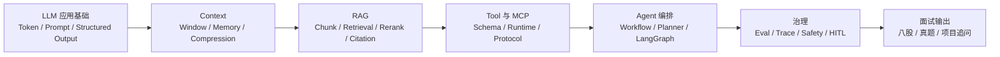

# AI Agent 工程学习手册

Agent Learning Workbench

<h1 class="hero-title">把 Agent 学习做成一条可复习、可实践、可追问的主线</h1>

围绕 LLM 应用、Context、RAG、Tool/MCP、Agent 编排、Eval、安全、Python 与工程基础，把知识点、代码实践、八股答案和真题追问接成同一套学习台。

[进入学习地图](AI%20Agent面试实践/学习地图.md){ .md-button .md-button--primary }
[刷 Agent 八股](AI%20Agent面试实践/面试八股总览.md){ .md-button }
[打开面试题库](面试题库/index.md){ .md-button }

推荐顺序

<ol class="rail-steps">
<li><strong>理解</strong>先看体系图和专题详解</li>
<li><strong>实践</strong>再看代码链路与项目复盘</li>
<li><strong>背诵</strong>压缩成八股答案和知识卡</li>
<li><strong>训练</strong>用真题与追问暴露盲区</li>
</ol>

6
主线阶段

2
闭环示范专题

4
训练层次

1
统一复习顺序

---

## 一、先选一个入口

### 系统学习 Agent

按 `LLM 应用基础 → Context → RAG → Tool/MCP → 编排 → 治理` 建立完整知识地图，适合第一遍打底。

[查看学习地图](AI%20Agent面试实践/学习地图.md){ .md-button }

### 从项目倒推知识

用知识库 Agent、工具型 Agent 和代码 Agent 的共性链路，把知识点落回架构、失败点和评测。

[进入项目复盘](项目实战与复盘/index.md){ .md-button }

### 直接开始练题

先刷八股，再练工程追问和公开面试题；遇到答不清的题再回专题页补原理。

[进入题库](面试题库/index.md){ .md-button }

---

## 二、Agent 知识主线

01
### LLM 应用基础
理解模型输入输出、Prompt、结构化输出与工具调用的最小闭环。

[进入基础专题](AI%20Agent面试实践/00_AI底层框架全景图/index.md)

02
### Context 与 Memory
回答模型当前看见什么、历史怎么压缩、记忆何时该检索。

[进入 Context 专题](AI%20Agent面试实践/08_Context工程/index.md)

03
### RAG 检索工程
把索引、召回、精排、引用和评测连成一条可靠链路。

[进入 RAG 专题](AI%20Agent面试实践/03_RAG检索增强/index.md)

04
### Tool 与 MCP
理解工具描述、执行边界、容错、安全与协议标准化。

[进入 Tool 专题](AI%20Agent面试实践/09_Tool与MCP工程实践/index.md)

05
### Agent 编排
掌握 ReAct、Workflow、LangGraph、Planner、Skill 与多 Agent 取舍。

[进入编排专题](AI%20Agent面试实践/04_LangChain_LangGraph/index.md)

06
### Eval 与安全
学会用指标、Trace、护栏和人工确认把系统从 Demo 推向可靠。

[进入治理专题](AI%20Agent面试实践/11_EvalTraceSafety/index.md)

---

## 三、学习闭环

<strong>专题详解</strong>
先讲概念、原理、图解和工程坑点。

<strong>代码实践</strong>
用 RAG、记忆、Tool、LangGraph 页面对照实现。

<strong>项目复盘</strong>
把知识点绑定到知识库、工具和代码 Agent 链路。

<strong>题库训练</strong>
八股先压缩答案，真题再练追问。

---

## 四、先用四个专题跑通闭环

### RAG 检索工程

先看证据链，再看最小实现，最后把排障答案练短。

- [专题入口](AI%20Agent面试实践/03_RAG检索增强/index.md)
- [代码实践](AI%20Agent面试实践/03_RAG检索增强/02_RAG完整链路_代码实践.md)
- [高频八股](AI%20Agent面试实践/03_RAG检索增强/03_RAG高频八股.md)
- [真题与追问](AI%20Agent面试实践/03_RAG检索增强/04_RAG真题与工程追问.md)

### Tool Calling 与 MCP

把工具能力、运行时边界、协议连接和安全追问放在一条线上。

- [专题入口](AI%20Agent面试实践/09_Tool与MCP工程实践/index.md)
- [Tool 学习页](AI%20Agent面试实践/09_Tool与MCP工程实践/01_Tool设计原则与容错.md)
- [高频八股](AI%20Agent面试实践/09_Tool与MCP工程实践/03_Tool与MCP高频八股.md)
- [真题与追问](AI%20Agent面试实践/09_Tool与MCP工程实践/04_Tool与MCP真题与工程追问.md)

### Context 与 Memory

把窗口预算、压缩、结构化笔记和长期记忆边界一次拆清。

- [专题入口](AI%20Agent面试实践/08_Context工程/index.md)
- [Context 学习页](AI%20Agent面试实践/08_Context工程/01_Context工程核心概念与面试考点.md)
- [高频八股](AI%20Agent面试实践/08_Context工程/05_Context与Memory高频八股.md)
- [真题与追问](AI%20Agent面试实践/08_Context工程/06_Context与Memory真题与工程追问.md)

### Eval、Trace 与 Safety

从质量回归、失败链路和执行边界理解 Agent 为什么能治理。

- [专题入口](AI%20Agent面试实践/11_EvalTraceSafety/index.md)
- [学习页](AI%20Agent面试实践/11_EvalTraceSafety/01_EvalTraceSafety学习页.md)
- [高频八股](AI%20Agent面试实践/11_EvalTraceSafety/02_EvalTraceSafety高频八股.md)
- [真题与追问](AI%20Agent面试实践/11_EvalTraceSafety/03_EvalTraceSafety真题与工程追问.md)

---

## 五、项目与题库

### 项目复盘

项目页重点看四件事：架构链路、难点拆解、评测指标、面试追问。

- [项目复盘入口](项目实战与复盘/index.md)
- [RAG 完整链路代码实践](AI%20Agent面试实践/03_RAG检索增强/02_RAG完整链路_代码实践.md)
- [知识库 Agent 复盘模板](项目实战与复盘/01_知识库Agent复盘模板.md)
- [工具型 Workflow Agent 复盘模板](项目实战与复盘/02_工具型WorkflowAgent复盘模板.md)

### 面试训练

题库按“标准答案 → 工程追问 → 公开题目 → 模拟口述”逐层加压。

- [Agent 面试八股总览](AI%20Agent面试实践/面试八股总览.md)
- [公开面试题整理](AI%20Agent面试实践/公开面试题整理.md)
- [综合模拟面试题库](AI%20Agent面试实践/08_模拟面试题与答案/01_综合模拟面试题库.md)

---

## 六、基础能力入口

[Python 从基础到面试](Python面试实践/00_零基础入门/01_变量与数据类型.md){ .foundation-link }
[Python 语言特性](Python面试实践/01_Python语言特性/01_核心概念与面试答题模板.md){ .foundation-link }
[高频算法手撕题](Python面试实践/03_面试高频手撕题/01_最长不重复子串.md){ .foundation-link }
[七天速通复习](AI%20Agent面试实践/99_七天速通训练营/index.md){ .foundation-link }

!!! tip "使用方式"
    第一遍从学习地图进专题；第二遍用项目复盘把知识点串起来；第三遍只刷八股、真题与高频追问。
