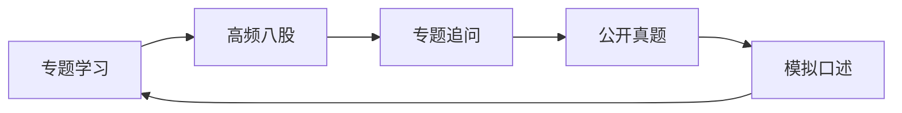

# 面试真题训练路线

> 真题训练的目标不是囤题，而是把每次被追问的空白回流到专题页。

## 一、先分清四类题

| 类型 | 训练重点 | 例子 |
| :--- | :--- | :--- |
| 八股题 | 定义、边界、原理 | RAG 完整链路是什么 |
| 工程追问 | 失败定位和取舍 | 工具超时怎么恢复 |
| 公开真题整理 | 题型覆盖和措辞变化 | 长上下文是否还需要 RAG |
| 手撕题 | 思路、复杂度和边界 | LRU、二分、滑动窗口 |

## 二、推荐训练顺序



## 三、Agent 真题怎么刷

| 顺序 | 入口 |
| :--- | :--- |
| 1 | [Agent 八股总览](../AI%20Agent面试实践/面试八股总览.md) |
| 2 | [公开面试题整理](../AI%20Agent面试实践/公开面试题整理.md) |
| 3 | [AI Agent 方向面试题合集](../AI%20Agent面试实践/08_模拟面试题与答案/02_AIAgent方向面试题合集.md) |
| 4 | [工程追问题库](工程追问题库.md) |

## 四、Python 真题怎么刷

| 顺序 | 入口 |
| :--- | :--- |
| 1 | [Python 面试真题整理](../Python面试实践/面试真题整理.md) |
| 2 | [语言特性答题页](../Python面试实践/01_Python语言特性/01_核心概念与面试答题模板.md) |
| 3 | [高频手撕题](../Python面试实践/03_面试高频手撕题/01_最长不重复子串.md) |

## 五、每道真题怎么复盘

```text
题目属于哪个专题：
我第一句话怎么答：
面试官可能追问什么：
项目或代码例子是什么：
答不清时要回补哪一页：
```
