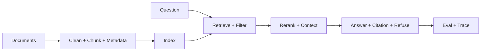

# 知识库 Agent 复盘模板

> 目标不是证明“接了向量库”，而是讲清知识怎样进入系统、证据怎样进入答案、错误怎样被发现。

## 一、项目定位

| 维度 | 复盘内容 |
| :--- | :--- |
| 用户目标 | 基于资料回答问题，并给出可追溯证据 |
| 核心链路 | 文档接入、索引、检索、上下文、回答、评测 |
| 关键专题 | RAG、Context、Eval、Safety |

## 二、主链路图

## 三、面试时要讲清的设计点

1. 文档接入如何保留标题、来源、版本和权限。
2. Chunk 为什么这样切，top_k 和 rerank 怎么取舍。
3. 无证据时为什么拒答，而不是让模型自由补全。
4. 检索错和生成错如何分层排查。
5. 知识更新后索引、缓存和引用如何同步。

## 四、失败点复盘

| 失败 | 优先排查 |
| :--- | :--- |
| 答案错但语气很肯定 | 证据是否进入上下文 |
| 引用有来源但片段不对 | 引用绑定和 chunk ID |
| 新文档搜不到 | ingestion、索引版本、过滤 |
| 召回结果很像但没答案 | chunk 粒度、query 改写、rerank |

## 五、关联学习页

- [RAG 专题入口](../AI%20Agent面试实践/03_RAG检索增强/index.md)
- [Context 与 Memory 专题](../AI%20Agent面试实践/08_Context工程/index.md)
- [Eval、Trace 与 Safety 专题](../AI%20Agent面试实践/11_EvalTraceSafety/index.md)
