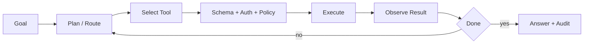

# 工具型 Workflow Agent 复盘模板

> 工具型 Agent 的复盘重点，是让模型的决策和运行时的执行边界都能被解释。

## 一、项目定位

| 维度 | 复盘内容 |
| :--- | :--- |
| 用户目标 | 把自然语言目标转成可控工具执行 |
| 核心链路 | 意图、计划、工具选择、执行、确认、回执 |
| 关键专题 | Tool/MCP、Workflow、Trace、Safety |

## 二、主链路图

## 三、面试时要讲清的设计点

1. 为什么工具描述和 schema 会影响调用正确率。
2. 运行时如何做参数校验、权限和高风险确认。
3. 工具失败时怎样区分重试、降级和停止。
4. Workflow 和 Agent 怎么取舍，哪些节点固定，哪些节点开放决策。
5. Trace 怎样保留工具参数、结果和策略判断。

## 四、失败点复盘

| 失败 | 优先排查 |
| :--- | :--- |
| 模型选错工具 | 描述重叠、路由约束、题集 |
| 参数看似合法但业务错 | 参数语义校验、预览 |
| 重试造成重复写入 | 幂等键、版本检查 |
| 用户看不到执行依据 | 回执、审计、Trace 摘要 |

## 五、关联学习页

- [Tool Calling 与 MCP 专题](../AI%20Agent面试实践/09_Tool与MCP工程实践/index.md)
- [Eval、Trace 与 Safety 专题](../AI%20Agent面试实践/11_EvalTraceSafety/index.md)
- [Agent 基础与编排](../AI%20Agent面试实践/01_Agent基础架构/00_核心概念初学者版.md)
